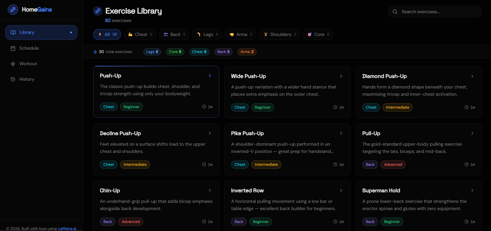

# 🏠 HomeGains

A modern web-based platform designed to help users manage, explore, and optimize home-related solutions efficiently. Built with a focus on usability, performance, and clean UI.

---

## 🚀 Features

- 🔐 User-friendly interface
- 📊 Smart data handling
- ⚡ Fast and responsive design
- 🧠 Scalable architecture
- 🌐 Web-based accessibility

---

## 🛠️ Tech Stack

**Frontend:**
- HTML
- CSS
- JavaScript

**Backend (if applicable):**
- Node.js / Python (Flask) *(update if needed)*

**Other Tools:**
- Git & GitHub
- APIs (if used)

---

## 📁 Project Structure
homegains/
│── assets/ # Images, GIFs, static files
│── frontend/ # UI related files
│── backend/ # Server-side code (if any)
│── README.md


---

## ⚙️ Installation & Setup

### 1️⃣ Clone the repository
```bash
git clone https://github.com/Vatsal12goil/homegains.git
cd homegains

2️⃣ Install dependencies
Bash

npm install
3️⃣ Run the project
Bash

npm start
```

---

# 🔥 Now real talk (important)

This README is **clean**, but to make it *next-level*:

👉 You should:
- Replace generic parts (backend, features) with **actual project logic**
- Add:
  - real screenshots
  - what problem it solves
  - why you built it

---

# 💯 If you want next upgrade

I can:
- Analyze your actual files deeply  
- Add **real features explanation (line by line project understanding)**  
- Create **premium GitHub profile style README (with badges + stats + typing animation)**  

Just say:  
👉 **“make it pro-level”** and I’ll upgrade this into a placement-ready README 🚀

🚀 **Live Preview:**  
👉 
[](https://homegains-u6y.caffeine.xyz/library)

